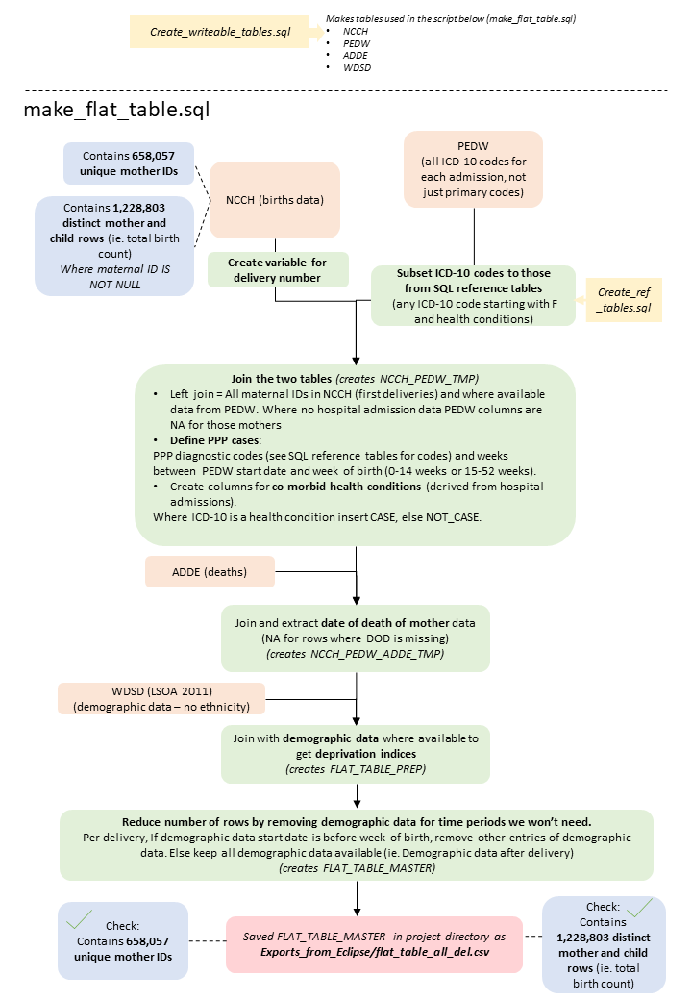
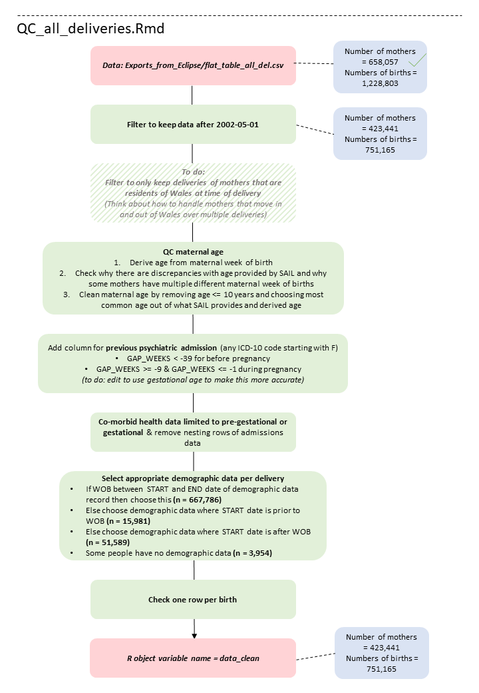

# Post-partum psychosis project

## Summary

This repo contains scripts I wrote for a project developed and led by my colleague, Dr Katie Marwick, investigating post-partum psychosis. These scripts detail the data cleaning process.

For more info please see my blog post on [my website](https://ameliaes.github.io/SQL-project).

______________________________

## TL;DR

### Data_Cleaning_SQL/make_flat_table.sql creates:
* **All deliveries**: S:\1515 - Postpartum psychosis- physical and mental comorbidity in a national linked d\Exports_from_Eclipse\flat_table_all_del.csv
* **First delivery**: S:\1515 - Postpartum psychosis- physical and mental comorbidity in a national linked d\Exports_from_Eclipse\flat_table_first_del.csv
* **See the header of the script (Data_Cleaning_SQL/make_flat_table.sql.) for more info on what the column names refer to and how the variables were derived.**

### Data_checks_R/QC_all_deliveries.Rmd
* This script lifts code from QC.Rmd to clean data on all deliveries. 
* This is work in progress, some of the code cannot be directly copied from QC.Rmd without some editing as the code in QC.Rmd is specific to only one delivery per mother.
* This will eventually create: S:\1515 - Postpartum psychosis- physical and mental comorbidity in a national linked/Cleaned_data/data_all_del_clean_final.csv
* **See preamble in this script for details on what extra columns were created in this script**

## Pipeline

1. **Collate the data.**
* Run Data_Cleaning_SQL/make_flat_table.sql. 
* This script requires tables that were made in Data_Cleaning_SQL/Create_ref_tables.sql and Data_Cleaning_SQL/Create_writeable_tables.sql. 
    * Data_Cleaning_SQL/Create_ref_tables.sql creates reference tables for ICD-10 codes.
    * Data_Cleaning_SQL/Create_writeable_tables.sql creates the writable tempory database tables.
* This script creates a table of all deliveries and a table of first deliveries, where each row corresponds to a child associated with a delivery. It is important to note the data is very nested at this stage. Each mother can have multiple deliveries, each delivery may have more than one baby (birth). There is also nesting in the demographic and hospital admission data, eg. for the deprivation index as each mother may have multiple entries for this corresponding to different dates and each mother may have many ICD-10 codes for different hospital spells (these are filtered out during the cleaning steps in R). 
* Files are saved manually from the output of this script called "flat_table_all_del.csv" and "flat_table_first_del.csv" in S:\1515 - Postpartum psychosis- physical and mental comorbidity in a national linked d\Exports_from_Eclipse.
* **See the header of the script (Data_Cleaning_SQL/make_flat_table.sql.) for more info on what the column names refer to and how the variables were derived.**

2. **Clean the data.**
* Run the R markdown file in Data_checks_R/QC_all_deliveries.Rmd.
* This script filters and cleans "flat_table_all_del.csv"
* Output will be saved to S:\1515 - Postpartum psychosis- physical and mental comorbidity in a national linked/Cleaned_data/data_all_del_clean_final.csv


## Schematic of pipeline



## Git instructions in the command line (rather than using the interface in Eclipse)
1. Change directory to the git repo:

```
# Open a Command Prompt window
# Change directories to git repo
P:
cd edmondsa\eclipse-workspace\main-repository-for-1515\

P:
cd marwickk\workspace\Postpartum psychosis 1515\main-repository-for-1515
```

2. Get any changes made which are on the gitlab (remote) to your computer before you begin working.

```
# Pull from the remote repo 
#(located here: https://gitlab.sail.ukserp.ac.uk/SAIL/1515/main-repository-for-1515)
git pull
```
Note: if prompted for username and authentication, select tab for passWORD not passCODE
See section below for accessing new scripts in Eclipse

3. Do some work and make changes to the repo

4. Check what files and changes you have made:

```
git status
```

5. To add something to git, 3 steps:
(add, message, push)
NB always pull first

```
# stage changes 
git add exampleScript.sql
# TOP TIP! If a file name has a space in it you can do this:
git add "example Script.sql"
# If a file has been removed you can do this:
git rm exampleScript.sql

# commit changes, include a little message explaining any changes you made
git commit -m "this is an example message"

# push changes, this means they are now on the remote repo (https://gitlab.sail.ukserp.ac.uk/SAIL/1515/main-repository-for-1515)
git push
```

## Open a script which is new to you in Eclipse
To open the script: 
1. Look in Bottom right panel. main-repository-for1515/Scripts
2. Either right click Scripts folder and select "Refresh" or select folder and press F5
New scripts pulled from GitLab should appear
To connect new script to database:
1. Open new script 
2. Look in panel of tools at top of window for a stack of discs with <NA> beside them.
3. Click this and option to connect to D2B LUW should appear
(If it doesn't check you have this connection active in Projects and see SAIL wiki about how to initialise this connection if not there)

## Best practices

* Export csv files of SQL query outputs to the shared folder (S:\1515 - Postpartum psychosis- physical and mental comorbidity in a national linked d\Exports_from_Eclipse). To export csv right click on output table in eclipse and save. Do not git track these csv files, only git track the code used to make these tables and summary plots/tables.

* Annotate important comments and code by initials and date (DD/MM/YY), also annotate code with a brief description of what the code does and if relevant (eg. SQL cleaning) some results from the code, eg. to track numbers of large groups of people as the script progresses. Be careful that any results pasted doesn't contain information that could be used to reidentify someone.

* If exporting a csv of a SQL query output annotate the SQL code with the exported csv file name.
